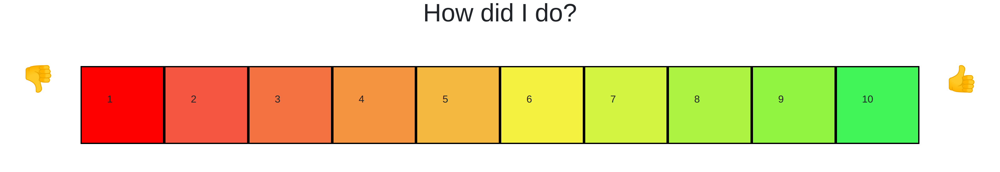
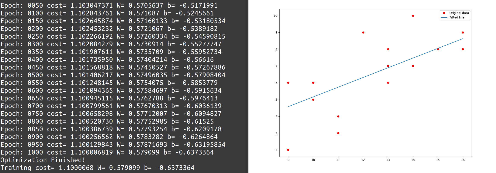

# Staff Optimiser
Business performance optimiser. Using customer feedback, sales and other data to review performance of a period of time.

## Motivation
Winchester Council held a hackathon at the University of Winchester. One challenge was to hack together solutions that help improve local business using machine learning algorithms to process data. This solution is simply a prototype, it uses a trivial linear regression algorithm but still manages to demonstrate the overall concept (to the demands of this Hackahon).

## Build Status
[](https://travis-ci.com/dtlight/staff-optimiser) Travis build fails because of a 10 minute time out. The repository works fine.

## User guide
This was aimed at local stores. A screen is displayed at checkout asking for a score. The figures are stored and tracked over time. Businesses can determine where staff work best. Perhaps have the staff with highest customer feedback on the tills and lowest in the stock room. Or maybe change shift patterns if one person scores better in the morning and another in the afternoon. 

The code can be modified for use in different scenarios, eg to monitor the number of drops a courier makes. A more detailed user guide is available [here](manual/User_Guide.md).

**Example of customer feedback at checkout:**



**Example of stats generated using regression algorithms**



## Code style

[](https://www.python.org/dev/peps/pep-0008/)

## Before you begin
Assuming you already have [Python 3](https://www.python.org/downloads), you'll also require tensorflow, flask and matplotlib

### Installing

Tensorflow

```bash
pip3 install tensorflow
```

Flask
```bash
pip3 install flask
```

Matplotlib (for plotting graphs)
```bash
pip install matplotlib
```

## Acknowledgements
[Aymeric Damien](https://github.com/aymericdamien/TensorFlow-Examples) and the team of contributors for their Tensor Flow examples

## License

MIT, feel free to add to, remove, or improve our code. Acknowledge those whose code we've built on :-)

[Dave Light](http://davelight.io)

[Dan Coventry](https://dcoventry97.github.io)

