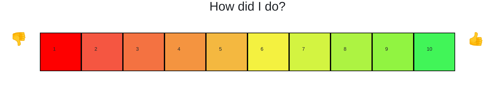
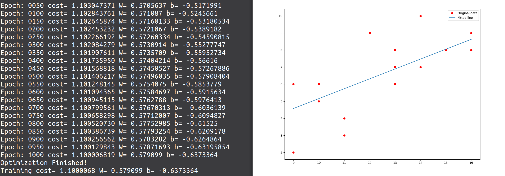

# User Guide
How it works and how to get it started

**To begin with**

To start the server, run main.py

Go to local host port 7643 (http://127.0.0.1:7643)

## Cashier Log In
The example in this case is 12768 but it can be anything. This could be modified to read from a set of users stored in a database, but for now it's just a demonstration. 

Once a user's id is entered the following prompt appears:

## Customer feedback

## Stats generated
Example below shows a linear regression algorithm producing output for each time interval (hourly blocks). 

X axis = time (rounded to the hour) 

Y axis = feedback score

## Business query
A businesses can now submit queries. Customer feedback trends are displayed.

